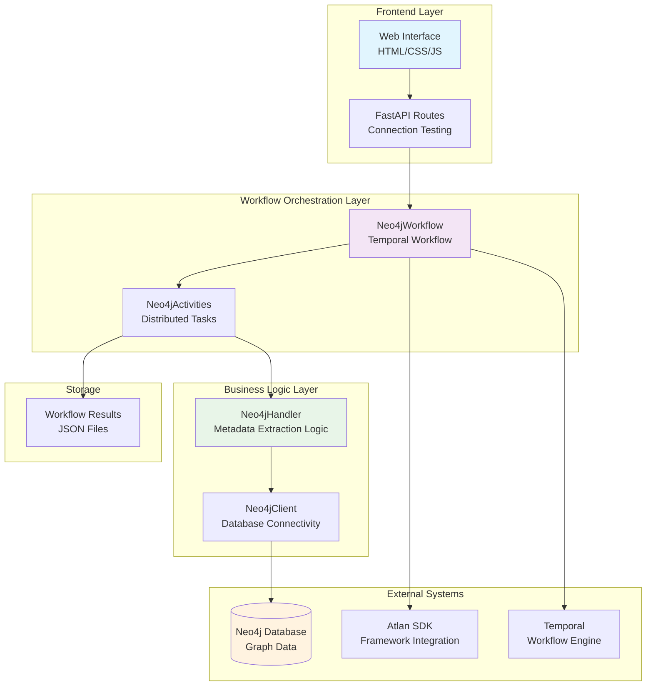
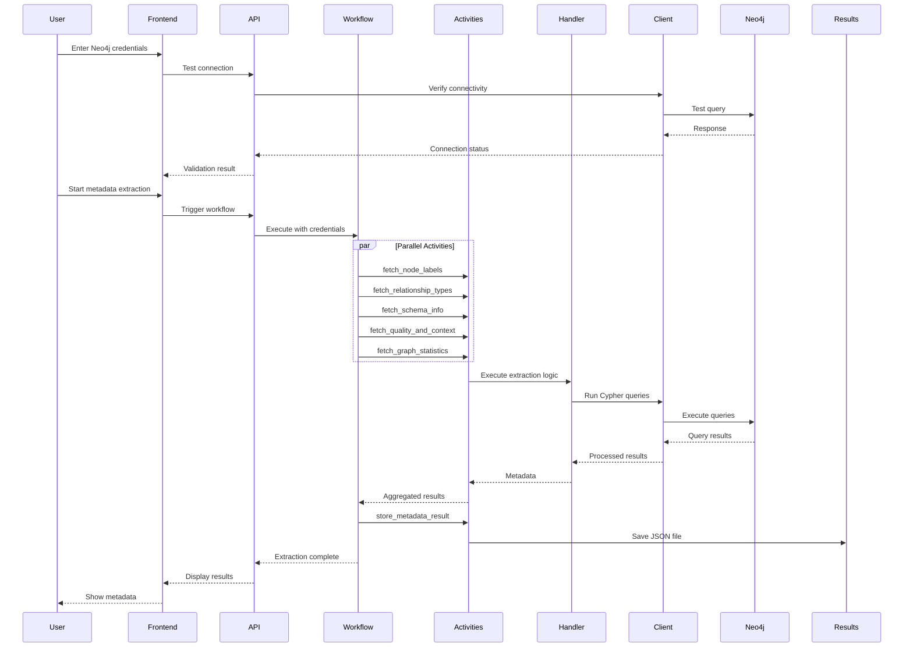
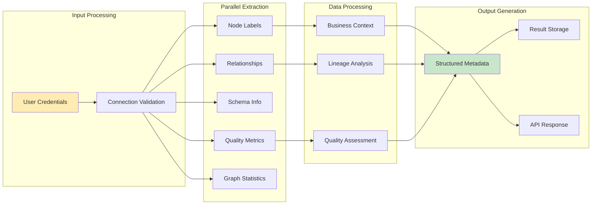
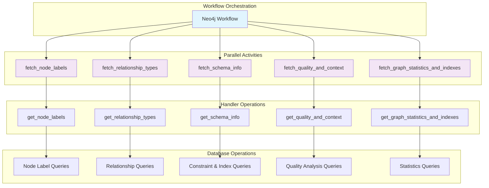

# NeoSense Architecture Design Document

**Author: Rohan Singh**
**Last Modified: September 13, 2025**
**Scope: System architecture and design decisions**

## Table of Contents

| S.No | Contents |
|------|----------|
| 1. | [Overview](#overview) |
| 2. | [System Architecture Overview](#-system-architecture-overview) |
|    | • [High-Level System Architecture](#high-level-system-architecture) |
|    | • [Component Interaction Flow](#component-interaction-flow) |
| 3. | [Core Architectural Decisions](#-core-architectural-decisions) |
|    | • [Layered Architecture](#1-layered-architecture-with-clear-separation-of-concerns) |
|    | • [Atlan Framework Integration](#2-atlan-framework-integration) |
|    | • [Parallel Processing](#3-parallel-processing-architecture) |
|    | • [Dynamic Credential Management](#4-dynamic-credential-management) |
|    | • [Error Handling Strategy](#5-comprehensive-error-handling-strategy) |
|    | • [Async/Sync Bridge Pattern](#6-asyncsync-bridge-pattern) |
| 4. | [Component Architecture](#-component-architecture) |
|    | • [Data Flow Architecture](#data-flow-architecture) |
|    | • [Activity-Based Task Distribution](#activity-based-task-distribution) |
| 5. | [Business Logic Architecture](#-business-logic-architecture) |
|    | • [Intelligent Metadata Categorization](#7-intelligent-metadata-categorization) |
|    | • [Advanced Quality Assessment](#8-advanced-quality-assessment-algorithm) |
| 6. | [Performance and Scalability](#-performance-and-scalability-decisions) |
|    | • [Connection Management](#12-connection-management-strategy) |
|    | • [Memory Management](#13-memory-management) |
| 7. | [Design Principles](#-design-principles-applied) |
| 8. | [Potential Improvements and Future Scope](#-potential-improvements-and-future-scope) |

## Overview

NeoSense is an intelligent Neo4j metadata extraction system that provides comprehensive graph database analysis and metadata discovery. This document outlines the high-level system architecture, key design decisions, and component interactions that make NeoSense a robust, scalable solution for graph database metadata management.

## System Architecture Overview

### High-Level System Architecture



### Component Interaction Flow



##  Core Architectural Decisions

### 1. **Layered Architecture with Clear Separation of Concerns**

**Decision**: Implement a four-layer architecture with distinct responsibilities

**Rationale**:
- **Maintainability**: Each layer has a single, well-defined responsibility
- **Testability**: Components can be tested independently
- **Scalability**: Easy to enhance or replace individual layers
- **Framework Alignment**: Follows Atlan SDK recommended patterns

**Implementation**:
```python
# Clear layer separation
Neo4jClient      → Database connectivity and query execution
Neo4jHandler     → Business logic and metadata extraction algorithms  
Neo4jActivities  → Fault-tolerant task execution with retry policies
Neo4jWorkflow    → Orchestration and result aggregation
```

### 2. **Atlan Framework Integration**

**Decision**: Built entirely on Atlan's Apps Framework for workflow orchestration

**Rationale**:
- **Framework Compliance**: Full adherence to Atlan SDK interfaces and patterns
- **Enterprise Standards**: Leverages proven patterns for workflow orchestration
- **Built-in Observability**: Comprehensive logging, metrics, and tracing
- **Scalability**: Benefits from Temporal's distributed workflow engine

**Implementation**:
```python
# Complete interface compliance
class Neo4jClient(ClientInterface)
class Neo4jHandler(HandlerInterface) 
class Neo4jActivities(ActivitiesInterface)
class Neo4jWorkflow(WorkflowInterface)
```

### 3. **Parallel Processing Architecture**

**Decision**: Concurrent metadata extraction using `asyncio.gather` instead of sequential processing

**Rationale**:
- **Performance**: Reduces total extraction time
- **Resource Efficiency**: Maximizes I/O utilization while Neo4j processes queries
- **User Experience**: Faster results improve usability and demo impact
- **Scalability**: Demonstrates understanding of concurrent programming patterns

**Implementation**:
```python
# Concurrent execution with error isolation
results = await asyncio.gather(
    fetch_node_labels(),           
    fetch_relationship_types(),      
    fetch_schema_info(),          
    fetch_quality_metrics(),       
    fetch_graph_stats(),          
    return_exceptions=True        
)
```

### 4. **Dynamic Credential Management**

**Decision**: Credentials for Neo4j are loaded from environment variables in `.env` file. Frontend credential input is also supported for demo purposes.

**Rationale**:
- **Demo Flexibility**: Users can connect to their own Neo4j databases using the frontend.
- **Production Readiness**: Supports loading credentials from environment variables for secure and configurable deployments.
- **Security**: Avoids hardcoding credentials in the application code.
- **User Experience**: Provides a professional interface with immediate feedback.

**Implementation**:
```python
# Secure credential flow: Frontend → API → Workflow → Activities
# Credentials can be provided via frontend or loaded from .env
uri = credentials.get("neo4j_uri") or os.environ.get("NEO4J_URI")
username = credentials.get("neo4j_username") or os.environ.get("NEO4J_USERNAME")
password = credentials.get("neo4j_password") or os.environ.get("NEO4J_PASSWORD")
```

### 5. **Comprehensive Error Handling Strategy**

**Decision**: Multi-level error resilience with partial failure recovery

**Rationale**:
- **Reliability**: System continues operating even if some metadata extraction fails
- **User Experience**: Provides meaningful error messages and recovery suggestions
- **Production Readiness**: Handles real-world scenarios like network timeouts
- **Debugging**: Comprehensive logging for troubleshooting

**Implementation**:
```python
# Multi-level error handling
retry_policy = RetryPolicy(
    initial_interval=timedelta(seconds=1),
    maximum_interval=timedelta(seconds=10),
    maximum_attempts=3,
    backoff_coefficient=2.0
)

# Partial failure handling
results = await asyncio.gather(..., return_exceptions=True)
successful_results = [r for r in results if not isinstance(r, Exception)]
failed_activities = [r for r in results if isinstance(r, Exception)]
```

### 6. **Async/Sync Bridge Pattern**

**Decision**: Thread pool execution for Neo4j's synchronous driver within async framework

**Rationale**:
- **Framework Compatibility**: Atlan SDK requires async patterns, Neo4j driver is synchronous
- **Performance**: Non-blocking I/O operations maintain system responsiveness
- **Best Practices**: Proper async/await usage throughout the application
- **Future-Proofing**: Ready for Neo4j's upcoming async driver

**Implementation**:
```python
# Thread pool execution for sync operations
async def run_query(self, query: str, params: Optional[Dict] = None):
    def _run_query():
        with self.driver.session() as session:
            result = session.run(query, params or {})
            return [record.data() for record in result]
    
    # Execute sync operation in thread pool
    results = await asyncio.get_event_loop().run_in_executor(None, _run_query)
    return results
```

##  Component Architecture

### Data Flow Architecture



### Activity-Based Task Distribution



## Business Logic Architecture

### 7. **Intelligent Metadata Categorization**

**Decision**: Four-category metadata organization (Schema, Business, Lineage, Quality)

**Rationale**:
- **Comprehensive Coverage**: Addresses all requirements plus advanced features
- **Business Value**: Each category provides actionable insights for data governance
- **Scalability**: Clear separation allows independent enhancement of each category
- **Impact**: Showcases depth of analysis beyond basic schema discovery

**Categories**:
```python
metadata_result = {
    "Schema Information": {      # Technical structure
        "node_labels": [...],
        "relationship_types": [...],
        "constraints": [...],
        "indexes": [...]
    },
    "Business Context": {        # Business intelligence
        "customer_segments": [...],
        "product_catalog": {...},
        "order_statistics": [...]
    },
    "Lineage Information": {     # Data relationships
        "relationship_patterns": {...},
        "data_flow": {...},
        "graph_dependencies": [...]
    },
    "Quality Metrics": {         # Data quality assessment
        "data_completeness": {...},
        "data_uniqueness": {...},
        "field_level_analysis": {...}
    }
}
```

### 8. **Advanced Quality Assessment Algorithm**

**Decision**: Multi-dimensional quality scoring with field-level analysis

**Rationale**:
- **Beyond Requirements**: Goes beyond basic null counts to comprehensive quality assessment
- **Actionable Insights**: Provides specific recommendations for data improvement
- **Business Value**: Provides completeness score with field-level breakdown
- **Innovation**: Demonstrates advanced analytical thinking

**Implementation**:
```python
def _calculate_completeness_summary(self, quality_metrics: Dict[str, Any]) -> Dict[str, Any]:
    total_records = sum(metrics["total_records"] for metrics in quality_metrics.values())
    total_null_records = sum(metrics["null_count"] for metrics in quality_metrics.values())
    overall_completeness = ((total_records - total_null_records) / total_records * 100)
    
    return {
        "overall_completeness_percentage": round(overall_completeness, 2),
        "field_level_completeness": self._analyze_field_completeness(quality_metrics),
        "recommendations": self._generate_quality_recommendations(quality_metrics)
    }
```

##  Technical Implementation Decisions

### 9. **Modular Component Design**

**Decision**: Clear separation of concerns across four main components

**Rationale**:
- **Maintainability**: Each component has a single, well-defined responsibility
- **Testability**: Components can be tested independently
- **Extensibility**: Easy to add new data sources or metadata types
- **Framework Alignment**: Follows Atlan SDK's recommended patterns

**Component Structure**:
```
Neo4jClient     → Database connectivity and query execution
Neo4jHandler    → Business logic and metadata extraction algorithms
Neo4jActivities → Fault-tolerant task execution with retry policies
Neo4jWorkflow   → Orchestration and result aggregation
```

### 10. **Comprehensive Observability Integration**

**Decision**: Full integration with Atlan's observability stack

**Rationale**:
- **Production Readiness**: Essential for monitoring and debugging in production
- **Framework Compliance**: Demonstrates proper SDK usage patterns
- **Debugging**: Rich logging helps with troubleshooting and optimization
- **Business Insights**: Logs provide valuable information about extraction results

**Implementation**:
```python
@observability(logger=logger, metrics=metrics, traces=traces)
async def run(self, workflow_config: Dict[str, Any]) -> dict:
    logger.info("🎯 NEOSENSE - INTELLIGENT NEO4J METADATA EXTRACTION")
    logger.info(f"   📊 Processing {total_nodes} nodes, {total_relationships} relationships")
    logger.info(f"   ✅ Data Quality Score: {quality_score:.2f}%")
```

## Performance and Scalability Decisions

### 11. **Connection Management Strategy**

**Decision**: Lazy initialization with connection reuse

**Rationale**:
- **Resource Efficiency**: Connections created only when needed
- **Performance**: Connection reuse reduces overhead
- **Reliability**: Proper connection lifecycle management
- **Scalability**: Supports multiple concurrent workflow executions

### 12. **Memory Management**

**Decision**: Streaming results with bounded memory usage

**Rationale**:
- **Scalability**: Handles large graphs without memory exhaustion
- **Performance**: Efficient processing of query results
- **Reliability**: Prevents out-of-memory errors in production

##  Design Principles Applied

### **1. Separation of Concerns**
Each component has a single, well-defined responsibility aligned with Atlan SDK interfaces.

### **2. Fail-Fast with Graceful Degradation**
Comprehensive validation with meaningful error messages, but continues operating with partial results.

### **3. Performance by Design**
Parallel processing, connection reuse, and efficient algorithms built in from the start.

### **4. Production-First Thinking**
Security, observability, error handling, and scalability considered throughout the design.

### **5. Framework-Native Patterns**
Full compliance with Atlan SDK interfaces and recommended practices.

##  Potential Improvements and Future Scope

### Potential Improvements

The following improvements can be made to enhance the overall system:

*   **Robust Error Handling**: Implementing a centralized error handling mechanism across the backend to improve logging, diagnostics, and recovery.
*   **Strategic Caching**: Employing caching strategies at various levels (e.g., data, API) to reduce database load and improve performance.
*   **Optimized Connection Management**: Enhancing database connection management through connection pooling and efficient resource allocation.
*   **Continuous Query Optimization**: Regularly analyzing and optimizing Cypher queries to minimize execution time and resource consumption.
*   **Comprehensive Data Quality Checks**: Implementing thorough data quality checks and validation processes to ensure data accuracy and reliability.
*   **Frontend Credential Input**: Allowing users to provide Neo4j credentials through the frontend for demo and testing purposes.
*   **Enhanced User Interface**: Developing a more intuitive, user-friendly, and visually appealing web interface to improve the user experience.

### Future Scope

The following features and enhancements can be considered for future development:

*   **Multi-Database Support**: Extending the application to support other graph databases beyond Neo4j.
*   **AI-Powered Metadata Enrichment**: Integrating machine learning algorithms to automatically enrich metadata with semantic information and business context.
*   **Customizable Metadata Extraction**: Allowing users to define custom rules and configurations for extracting specific metadata elements.
*   **Data Governance Integration**: Integrating with existing data governance platforms and tools to streamline metadata management and ensure compliance.
*   **Scalability and Cloud Deployment**: Optimizing the application for cloud deployment and implementing horizontal scaling techniques to handle increasing data volumes and user traffic.
*   **API Development**: Developing a comprehensive API to enable programmatic access to metadata and integration with other applications and systems.
