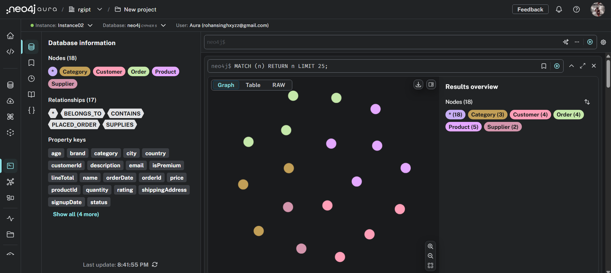
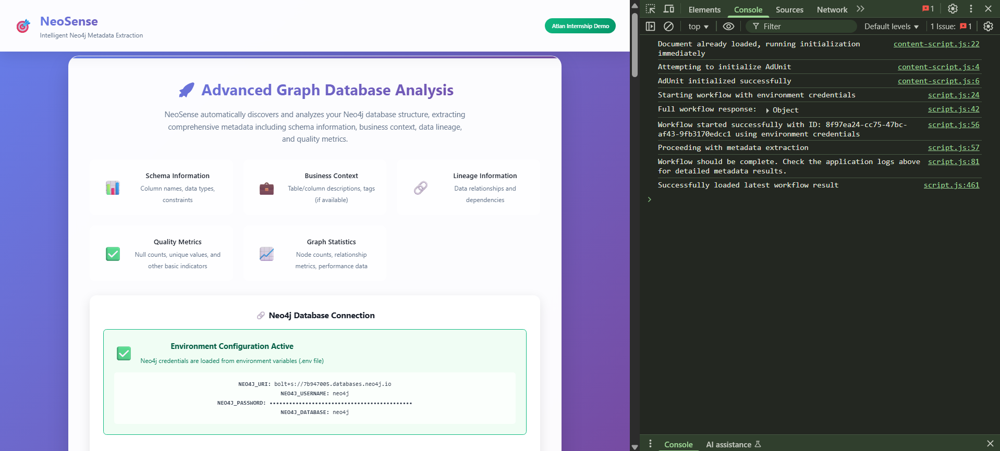
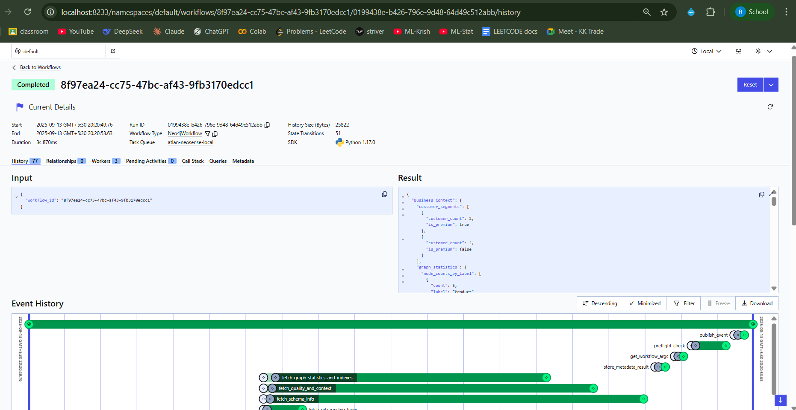
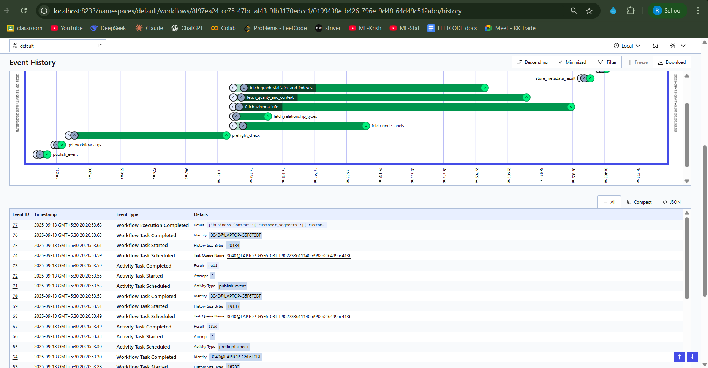
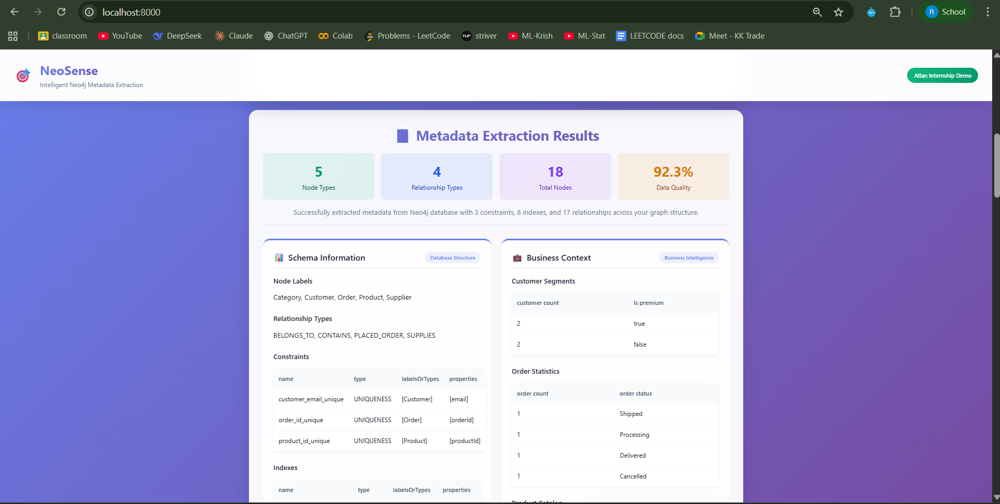
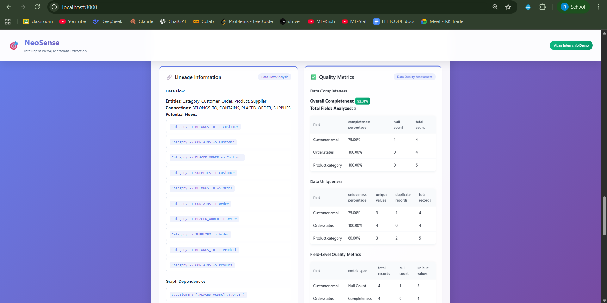
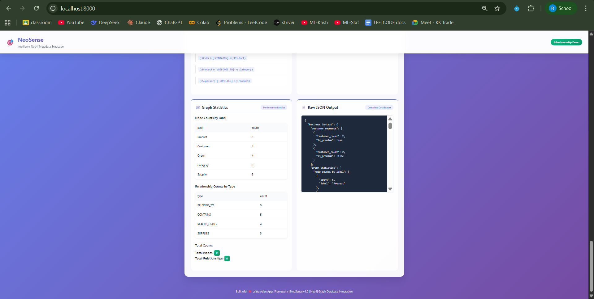

# NeoSense Demo Guide

**Author: Rohan Singh**  
**Last Modified: September 13, 2025**  
**Scope: Application demonstration and setup instructions**

## Table of Contents
| S.No | Section |
|------|---------|
| **1.** | [Overview](#overview) |
| **2.** | [Application Setup](#application-setup) |
|      | ▸ [Prerequisites](#prerequisites) |
|      | ▸ [Environment Configuration](#environment-configuration) |
|      | ▸ [Package Synchronization](#package-synchronization) |
|      | ▸ [Starting Temporal Server](#starting-temporal-server) |
|      | ▸ [Starting NeoSense Application](#starting-neosense-application) |
| **3.** | [Sample Data Setup](#sample-data-setup) |
| **4.** | [Demo Instructions](#demo-instructions) |
|      | ▸ [Step 1: Access NeoSense Application](#step-1-access-neosense-application) |
|      | ▸ [Step 2: Verify Database Connection](#step-2-verify-database-connection) |
|      | ▸ [Step 3: Start Metadata Extraction](#step-3-start-metadata-extraction) |
|      | ▸ [Step 4: Monitor Workflow Execution](#step-4-monitor-workflow-execution) |
|      | ▸ [Step 5: View Temporal Dashboard](#step-5-view-temporal-workflow-dashboard-optional) |
|      | ▸ [Step 6: Analyze Results](#step-6-analyze-extracted-results) |
|      | ▸ [Step 7: View Raw JSON Output](#step-7-view-raw-json-output-optional) |
| **5.** | [Expected Results](#expected-results) |
|      | ▸ [Performance Metrics](#expected-workflow-performance) |
|      | ▸ [Key Features Demonstrated](#key-features-demonstrated) |
| **6.** | [Troubleshooting](#troubleshooting) |

## Overview

This guide provides step-by-step instructions for demonstrating NeoSense's intelligent Neo4j metadata extraction capabilities. The application showcases real-time workflow orchestration using Temporal and comprehensive metadata analysis from Neo4j databases.

## Application Setup

### Prerequisites
- Neo4j Aura database running with sample data
- Python environment with uv package manager installed
- VS Code or any IDE for running commands
- Dapr CLI installed

### Environment Configuration

**First, create a `.env` file in your project root with your Neo4j credentials:**

```env
NEO4J_URI=bolt+s://your-neo4j-uri
NEO4J_PASSWORD=your-password
NEO4J_DATABASE=neo4j-database-name
```

Replace the placeholders with your actual Neo4j Aura connection details:
- `your-neo4j-uri`: Your Neo4j Aura instance URI (without the bolt+s:// prefix in the actual value)
- `your-password`: Your Neo4j database password
- `neo4j-database-name`: Usually "neo4j" for default database

### Package Synchronization

**Before starting the application, synchronize packages using uv:**

```bash
uv sync
```

This command will:
- Install and synchronize all project dependencies
- Ensure all packages are properly configured
- Set up the virtual environment if needed

### Starting Temporal Server

**Second, start the Temporal development server:**

```bash
temporal server start-dev --db-filename ./temporal.db
```

This command will:
- Start the Temporal server in development mode
- Create a local database file for workflow persistence
- Make Temporal UI available at `localhost:8233`

### Starting NeoSense Application

**Third, start the NeoSense application with Dapr:**

```bash
dapr run --app-id app --app-port 8000 --dapr-http-port 3555 --resources-path ./components --config config.yaml -- python main.py
```

This command will:
- Start the NeoSense application on port 8000
- Initialize Dapr runtime with specified configuration
- Make the frontend accessible at `localhost:8000`
- Enable workflow orchestration through Temporal

**Wait for both services to be ready before proceeding with the demo.**

## Sample Data Setup

Access your Neo4j Aura database console and run the following script to create the test dataset:




The above image shows the Neo4j Aura interface with the sample data loaded, displaying 18 nodes across 5 different labels (Category, Customer, Order, Product, Supplier) and their relationships.

```cypher
// Clean existing data (optional - only if you want to start fresh)
MATCH (n) DETACH DELETE n;

// Create constraints for data integrity (Schema Information)
CREATE CONSTRAINT customer_email_unique IF NOT EXISTS FOR (c:Customer) REQUIRE c.email IS UNIQUE;
CREATE CONSTRAINT product_id_unique IF NOT EXISTS FOR (p:Product) REQUIRE p.productId IS UNIQUE;
CREATE CONSTRAINT order_id_unique IF NOT EXISTS FOR (o:Order) REQUIRE o.orderId IS UNIQUE;

// Create additional indexes for performance (will be detected by NeoSense)
CREATE INDEX customer_name_index IF NOT EXISTS FOR (c:Customer) ON (c.name);
CREATE INDEX product_category_index IF NOT EXISTS FOR (p:Product) ON (c.category);
CREATE INDEX order_status_index IF NOT EXISTS FOR (o:Order) ON (o.status);

// Create Customer nodes with varied data quality scenarios
CREATE (c1:Customer {
    customerId: 'c001', 
    name: 'Alice Johnson', 
    email: 'alice@example.com', 
    signupDate: date('2023-01-15'), 
    isPremium: true,
    age: 28,
    city: 'New York'
});

CREATE (c2:Customer {
    customerId: 'c002', 
    name: 'Bob Smith', 
    email: 'bob@example.com', 
    signupDate: date('2023-02-20'), 
    isPremium: false,
    age: 35,
    city: 'Los Angeles'
});

CREATE (c3:Customer {
    customerId: 'c003', 
    name: 'Charlie Brown', 
    email: null,  // Null email for quality metrics demo
    signupDate: date('2023-03-10'), 
    isPremium: false,
    age: null,    // Null age for completeness analysis
    city: 'Chicago'
});

CREATE (c4:Customer {
    customerId: 'c004', 
    name: 'Diana Prince', 
    email: 'diana@example.com', 
    signupDate: date('2023-04-05'), 
    isPremium: true,
    age: 32,
    city: 'Seattle'
});

// Create Product nodes with rich metadata
CREATE (p1:Product {
    productId: 'p001', 
    name: 'MacBook Pro', 
    category: 'Electronics', 
    price: 1299.99, 
    stock: 45, 
    description: 'High-performance laptop for professionals and creatives.',
    brand: 'Apple',
    rating: 4.8
});

CREATE (p2:Product {
    productId: 'p002', 
    name: 'Wireless Mouse', 
    category: 'Electronics', 
    price: 29.99, 
    stock: 150, 
    description: 'Ergonomic wireless mouse with precision tracking.',
    brand: 'Logitech',
    rating: 4.5
});

CREATE (p3:Product {
    productId: 'p003', 
    name: 'Data Science Handbook', 
    category: 'Books', 
    price: 45.99, 
    stock: 75, 
    description: null,  // Null description for quality analysis
    brand: 'O\'Reilly',
    rating: 4.7
});

CREATE (p4:Product {
    productId: 'p004', 
    name: 'USB-C Hub', 
    category: 'Electronics', 
    price: 79.99, 
    stock: 0,  // Out of stock
    description: 'Multi-port USB-C hub with HDMI and ethernet.',
    brand: 'Anker',
    rating: 4.3
});

CREATE (p5:Product {
    productId: 'p005', 
    name: 'Coffee Mug', 
    category: 'Office Supplies', 
    price: 12.99, 
    stock: 200, 
    description: 'Ceramic coffee mug with company logo.',
    brand: 'Generic',
    rating: 4.0
});

// Create Order nodes with comprehensive relationship patterns
CREATE (o1:Order {
    orderId: 'o101', 
    orderDate: datetime('2025-01-20T10:30:00Z'), 
    status: 'Shipped',
    totalAmount: 1329.98,
    shippingAddress: 'New York, NY'
});

CREATE (o2:Order {
    orderId: 'o102', 
    orderDate: datetime('2025-02-15T14:45:00Z'), 
    status: 'Processing',
    totalAmount: 229.95,
    shippingAddress: 'Los Angeles, CA'
});

CREATE (o3:Order {
    orderId: 'o103', 
    orderDate: datetime('2025-03-01T09:15:00Z'), 
    status: 'Delivered',
    totalAmount: 91.98,
    shippingAddress: 'Chicago, IL'
});

CREATE (o4:Order {
    orderId: 'o104', 
    orderDate: datetime('2025-03-10T16:20:00Z'), 
    status: 'Cancelled',
    totalAmount: 79.99,
    shippingAddress: 'Seattle, WA'
});

// Create comprehensive relationship patterns for lineage analysis
// Alice's orders
MATCH (c1:Customer {customerId: 'c001'}), (o1:Order {orderId: 'o101'})
CREATE (c1)-[:PLACED_ORDER {orderDate: datetime('2025-01-20T10:30:00Z')}]->(o1);

MATCH (o1:Order {orderId: 'o101'}), (p1:Product {productId: 'p001'})
CREATE (o1)-[:CONTAINS {quantity: 1, unitPrice: 1299.99, lineTotal: 1299.99}]->(p1);

MATCH (o1:Order {orderId: 'o101'}), (p2:Product {productId: 'p002'})
CREATE (o1)-[:CONTAINS {quantity: 1, unitPrice: 29.99, lineTotal: 29.99}]->(p2);

// Bob's orders
MATCH (c2:Customer {customerId: 'c002'}), (o2:Order {orderId: 'o102'})
CREATE (c2)-[:PLACED_ORDER {orderDate: datetime('2025-02-15T14:45:00Z')}]->(o2);

MATCH (o2:Order {orderId: 'o102'}), (p3:Product {productId: 'p003'})
CREATE (o2)-[:CONTAINS {quantity: 5, unitPrice: 45.99, lineTotal: 229.95}]->(p3);

// Charlie's orders
MATCH (c3:Customer {customerId: 'c003'}), (o3:Order {orderId: 'o103'})
CREATE (c3)-[:PLACED_ORDER {orderDate: datetime('2025-03-01T09:15:00Z')}]->(o3);

MATCH (o3:Order {orderId: 'o103'}), (p3:Product {productId: 'p003'})
CREATE (o3)-[:CONTAINS {quantity: 2, unitPrice: 45.99, lineTotal: 91.98}]->(p3);

// Diana's cancelled order
MATCH (c4:Customer {customerId: 'c004'}), (o4:Order {orderId: 'o104'})
CREATE (c4)-[:PLACED_ORDER {orderDate: datetime('2025-03-10T16:20:00Z')}]->(o4);

MATCH (o4:Order {orderId: 'o104'}), (p4:Product {productId: 'p004'})
CREATE (o4)-[:CONTAINS {quantity: 1, unitPrice: 79.99, lineTotal: 79.99}]->(p4);

// Create additional nodes for richer business context
CREATE (cat1:Category {name: 'Electronics', description: 'Electronic devices and accessories'});
CREATE (cat2:Category {name: 'Books', description: 'Educational and reference books'});
CREATE (cat3:Category {name: 'Office Supplies', description: 'Office and workplace items'});

// Create supplier relationships
CREATE (s1:Supplier {supplierId: 's001', name: 'Tech Distributors Inc', country: 'USA'});
CREATE (s2:Supplier {supplierId: 's002', name: 'Book Publishers Ltd', country: 'UK'});

// Link products to categories and suppliers
MATCH (p:Product {category: 'Electronics'}), (cat:Category {name: 'Electronics'})
CREATE (p)-[:BELONGS_TO]->(cat);

MATCH (p:Product {category: 'Books'}), (cat:Category {name: 'Books'})
CREATE (p)-[:BELONGS_TO]->(cat);

MATCH (p:Product {category: 'Office Supplies'}), (cat:Category {name: 'Office Supplies'})
CREATE (p)-[:BELONGS_TO]->(cat);

MATCH (p1:Product {productId: 'p001'}), (s1:Supplier {supplierId: 's001'})
CREATE (s1)-[:SUPPLIES]->(p1);

MATCH (p2:Product {productId: 'p002'}), (s1:Supplier {supplierId: 's001'})
CREATE (s1)-[:SUPPLIES]->(p2);

MATCH (p3:Product {productId: 'p003'}), (s2:Supplier {supplierId: 's002'})
CREATE (s2)-[:SUPPLIES]->(p3);
```

## Demo Instructions

### Step 1: Access NeoSense Application
1. Ensure both Temporal server and NeoSense application are running
2. Open your browser and navigate to `http://localhost:8000`
3. You'll see the NeoSense interface with the main dashboard

[NeoSense Application Interface]

**What you'll see:**
- Clean, professional interface titled "NeoSense - Intelligent Neo4j Metadata Extraction"
- "Advanced Graph Database Analysis" section with four metadata categories
- Connection status showing environment credentials are active

### Step 2: Verify Database Connection
1. The application should show "Environment Configuration Active" 
2. You'll see your Neo4j credentials (URI, username, database) with masked password
3. Connection is automatically verified on application startup


**Expected display:**
- NEO4J_URI: `bolt+s://[your-neo4j-aura-uri]`
- NEO4J_USERNAME: `neo4j`
- NEO4J_DATABASE: `neo4j`

### Step 3: Start Metadata Extraction
1. Click the "Atlan Internship Demo" button to trigger the workflow
2. The system will initiate a Temporal workflow for metadata extraction

**What happens behind the scenes:**
- Temporal workflow starts with unique workflow ID
- Five parallel activities execute simultaneously:
  - `fetch_node_labels`
  - `fetch_relationship_types` 
  - `fetch_schema_info`
  - `fetch_quality_and_context`
  - `fetch_graph_statistics_and_indexes`

### Step 4: Monitor Workflow Execution
1. Open browser developer tools (F12) and check the Console tab
2. You'll see real-time progress messages:
   - "Starting workflow with environment credentials"
   - "Workflow started successfully with ID: [workflow-id]"
   - "Proceeding with metadata extraction"
   - "Workflow should be complete. Check the application logs above for detailed metadata results."
   - "Successfully loaded latest workflow result"

### Step 5: View Temporal Workflow Dashboard (Optional)
1. Navigate to `http://localhost:8233/namespaces/default/workflows/[workflow-id]/history`
2. You can see the complete workflow execution timeline
3. View individual activity execution times and results
4. Monitor the parallel execution pattern in the Event History





**Temporal Dashboard shows:**
- Workflow execution timeline with all activities
- Parallel execution of metadata extraction tasks
- Individual activity completion times
- Complete workflow result with business context and statistics

The Event History view displays the detailed execution flow showing all five activities running in parallel, demonstrating the efficient distributed processing architecture.

### Step 6: Analyze Extracted Results

The application will display comprehensive metadata across four categories:

[Metadata Extraction Results Overview]

**📊 Schema Information:**
- **Node Types:** 5 types (Category, Customer, Order, Product, Supplier)
- **Relationship Types:** 4 types (BELONGS_TO, CONTAINS, PLACED_ORDER, SUPPLIES)
- **Total Nodes:** 18 nodes across the graph
- **Data Quality Score:** 92.3%

**🏢 Business Context:**
- **Customer Segments:** 
  - 2 premium customers (50%)
  - 2 regular customers (50%)
- **Order Statistics:** Distribution across Shipped, Processing, Delivered, and Cancelled statuses
- **Product Catalog:** 5 products across multiple categories


**🔗 Lineage Information:**
- **Data Flow Entities:** Category, Customer, Order, Product, Supplier
- **Connections:** BELONGS_TO, CONTAINS, PLACED_ORDER, SUPPLIES
- **Potential Flows:** Complete relationship mapping showing data dependencies
- **Graph Dependencies:** Customer→Order→Product flow patterns

**📈 Quality Metrics:**
- **Overall Completeness:** 92.31%
- **Field-Level Analysis:**
  - Customer.email: 75.00% complete (1 null out of 4 records)
  - Order.status: 100.00% complete  
  - Product.category: 100.00% complete
- **Data Uniqueness Analysis:**
  - Customer.email: 75.00% unique values
  - Order.status: 100.00% unique across records
  - Product.category: 60.00% uniqueness (multiple products share categories)




**📊 Graph Statistics:**
- **Node Counts by Label:**
  - Product: 5 nodes
  - Customer: 4 nodes
  - Order: 4 nodes
  - Category: 3 nodes
  - Supplier: 2 nodes

- **Relationship Counts by Type:**
  - BELONGS_TO: 5 relationships
  - CONTAINS: 5 relationships
  - PLACED_ORDER: 4 relationships
  - SUPPLIES: 3 relationships

- **Total Counts:**
  - Total Nodes: 18
  - Total Relationships: 17


**🧾Raw JSON Output:**
The complete extracted metadata is also available in structured **JSON format** for data catalog integration.

- **business_context:** Customer segments, order statistics, and business metrics
- **graph_statistics:** Complete node and relationship counts by type
- **schema_info:** Node labels, relationship types, constraints, and indexes
- **quality_metrics:** Field-level completeness and uniqueness analysis
- **lineage_info:** Data flow patterns and graph dependencies

This JSON output can be seamlessly ingested by metadata management platforms such as **Apache Atlas, DataHub, or Collibra**, enabling **automated metadata ingestion, lineage tracking, and governance workflows**.



### Expected Workflow Performance
- **Total Execution Time:** ~30-60 seconds
- **Parallel Activity Execution:** All 5 activities run simultaneously
- **Database Operations:** ~15-20 Cypher queries executed
- **Data Processing:** 18 nodes and 17 relationships analyzed

### Key Features Demonstrated
1. **Real-time Workflow Orchestration:** Temporal-based distributed task execution
2. **Parallel Processing:** Multiple metadata extraction activities running concurrently
3. **Comprehensive Analysis:** Four-dimensional metadata coverage
4. **Quality Assessment:** Automated data completeness and uniqueness analysis
5. **Business Intelligence:** Customer segmentation and order pattern analysis
6. **Schema Discovery:** Complete graph structure mapping
7. **Lineage Tracking:** Data flow and dependency analysis

## Troubleshooting
- **Package Issues:** Run `uv sync` before starting the application
- **Environment Variables:** Ensure `.env` file exists with correct Neo4j credentials
- **Temporal Server Not Running:** Ensure `temporal server start-dev` command completed successfully
- **Application Not Starting:** Check if port 8000 is available and Dapr is installed
- **No Results:** Verify sample data was loaded correctly in Neo4j
- **Connection Issues:** Check Neo4j credentials and network connectivity in `.env` file
- **Workflow Timeout:** Ensure Temporal server is running and accessible at localhost:8233
- **Browser Issues:** Use Chrome/Firefox with developer tools for best experience
