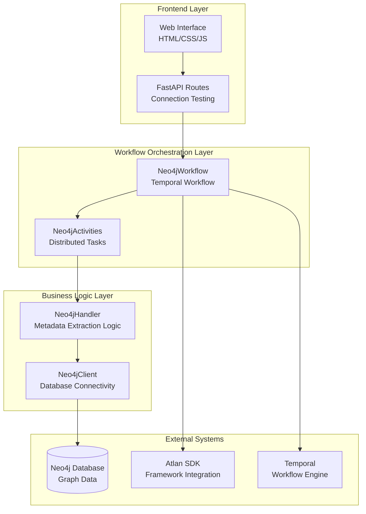

# NeoSense - Neo4j Metadata Extraction

NeoSense is an intelligent metadata extraction application built on Atlan's Apps Framework for Neo4j graph databases. It provides comprehensive metadata discovery including schema information, business context extraction, data lineage mapping, and quality analytics.

## Table of Contents

| Section | Description |
|---------|-------------|
| [Project Structure](#project-structure) | Overview of the codebase organization |
| [Key Features](#key-features) | Core functionality and capabilities |
| [Prerequisites](#prerequisites) | Required dependencies and setup |
| [Installation](#installation) | Step-by-step installation guide |
| [Configuration](#configuration) | Environment setup and database connection |
| [Usage](#usage) | How to run and use the application |
| [Architecture Overview](#architecture-overview) | System design and component interactions |
| [Demo Instructions](#demo-instructions) | Testing with sample data |
| [Troubleshooting](#troubleshooting) | Common issues and solutions |

#  Neosense Project Structure  

This document provides an overview of the directory structure and purpose of each component in the **Neosense** project.  

```
neosense/
├── app/                      # Core application logic
│   ├── queries/              # Cypher queries for Neo4j
│   │   └── __init__.py
│   │
│   ├── activities.py         # Temporal activities (fault-tolerant tasks)
│   ├── client.py             # Neo4j database client
│   ├── handler.py            # Business logic & metadata extraction
│   └── workflow.py           # Workflow orchestration
│   │
│   ├── frontend/             # Web interface
│   ├── static/               # Frontend assets
│   │   ├── script.js         # Frontend JavaScript
│   │   └── styles.css        # UI styling
│   │
│   └── templates/
│       └── index.html        # Main UI template
│
├── components/               # Dapr components
│   ├── objectstore.yaml      # Object store configuration
│   └── statestore.yaml       # State store configuration
│
├── deploy/                   # Deployment configurations
│   ├── Dockerfile            # Container definition
│   ├── entrypoint.sh         # Startup script
│   ├── supervisord.conf      # Process manager configuration
│   └── README.md             # Deployment guide
│
├── images/                   # Project-related images
│
├── local/                    # Local environment resources
│   └── .gitattributes        # Git attributes configuration
│
├── .gitignore                # Ignored files for Git
├── ARCHITECTURE_NOTES.md     # Notes on system architecture
├── DEMO_GUIDE.md             # Guide for running project demo
├── FRAMEWORK_NOTES.md        # Framework-specific notes
├── README.md                 # Project documentation
│
├── config.yaml               # Dapr configuration
├── main.py                   # Application entry point
└── pyproject.toml            # Python dependencies & project config
```

## Key Features

### Core Metadata Extraction
- **Schema Discovery**: Automated detection of node labels, relationship types, properties, constraints, and indexes
- **Business Intelligence**: Customer segmentation, product catalog analysis, and order analytics
- **Data Lineage**: Comprehensive relationship pattern analysis and data flow mapping
- **Quality Analytics**: Multi-dimensional data quality assessment with completeness and uniqueness metrics

### Technical Capabilities
- **Parallel Processing**: Concurrent metadata extraction for optimal performance
- **Fault Tolerance**: Advanced retry policies and graceful error handling
- **Real-time Monitoring**: Comprehensive logging and workflow observability
- **Interactive UI**: Modern web interface with detailed metadata visualization

## Prerequisites

- **Python 3.11+** - Modern Python with async/await support
- **Neo4j Database** - Local installation or Neo4j Aura cloud instance
- **UV Package Manager** - Fast Python package management
- **Dapr CLI** - For distributed application runtime
- **Temporal Server** - Workflow orchestration engine

## Installation

### 1. Clone Repository
```bash
git clone https://github.com/Strizzyy/neosense.git
cd neosense
```

### 2. Install Dependencies
```bash
# Install dependencies using UV
uv sync

# Verify installation
uv run python --version  # Should show Python 3.11+
```

### 3. Neo4j Database Setup

**Option A: Local Neo4j**
```bash
# Install Neo4j Desktop or Community Edition
# Start Neo4j service
# Default connection: bolt://localhost:7687
```

**Option B: Neo4j Aura (Cloud)**
```bash
# Create free account at https://neo4j.com/aura/
# Get connection details: bolt+s://your-instance.databases.neo4j.io
```

## Configuration

### Environment Variables

Create a `.env` file in the project root with your Neo4j credentials:

```env
NEO4J_URI=bolt+s://your-neo4j-uri
NEO4J_USERNAME=neo4j
NEO4J_PASSWORD=your-password
NEO4J_DATABASE=neo4j
```

Replace the placeholders with your actual Neo4j connection details:
- `your-neo4j-uri`: Your Neo4j instance URI
- `your-password`: Your Neo4j database password
- `neo4j`: Default database name (usually "neo4j")

### Sample Data Setup

For demonstration purposes, run this Cypher script in your Neo4j database:

```cypher
// Create constraints for data integrity
CREATE CONSTRAINT customer_email_unique IF NOT EXISTS FOR (c:Customer) REQUIRE c.email IS UNIQUE;
CREATE CONSTRAINT product_id_unique IF NOT EXISTS FOR (p:Product) REQUIRE p.productId IS UNIQUE;
CREATE CONSTRAINT order_id_unique IF NOT EXISTS FOR (o:Order) REQUIRE o.orderId IS UNIQUE;

// Create indexes for performance
CREATE INDEX customer_name_index IF NOT EXISTS FOR (c:Customer) ON (c.name);
CREATE INDEX product_category_index IF NOT EXISTS FOR (p:Product) ON (c.category);
CREATE INDEX order_status_index IF NOT EXISTS FOR (o:Order) ON (o.status);

// Create Customer nodes with varied data quality scenarios
CREATE (c1:Customer {
    customerId: 'c001', 
    name: 'Alice Johnson', 
    email: 'alice@example.com', 
    signupDate: date('2023-01-15'), 
    isPremium: true,
    age: 28,
    city: 'New York'
});

CREATE (c2:Customer {
    customerId: 'c002', 
    name: 'Bob Smith', 
    email: 'bob@example.com', 
    signupDate: date('2023-02-20'), 
    isPremium: false,
    age: 35,
    city: 'Los Angeles'
});

// Create Product nodes
CREATE (p1:Product {
    productId: 'p001', 
    name: 'MacBook Pro', 
    category: 'Electronics', 
    price: 1299.99, 
    stock: 45, 
    description: 'High-performance laptop for professionals and creatives.',
    brand: 'Apple',
    rating: 4.8
});

CREATE (p2:Product {
    productId: 'p002', 
    name: 'Wireless Mouse', 
    category: 'Electronics', 
    price: 29.99, 
    stock: 150, 
    description: 'Ergonomic wireless mouse with precision tracking.',
    brand: 'Logitech',
    rating: 4.5
});

// Create Order nodes and relationships
CREATE (o1:Order {
    orderId: 'o101', 
    orderDate: datetime('2025-01-20T10:30:00Z'), 
    status: 'Shipped',
    totalAmount: 1329.98,
    shippingAddress: 'New York, NY'
});

// Create relationships
MATCH (c1:Customer {customerId: 'c001'}), (o1:Order {orderId: 'o101'})
CREATE (c1)-[:PLACED_ORDER {orderDate: datetime('2025-01-20T10:30:00Z')}]->(o1);

MATCH (o1:Order {orderId: 'o101'}), (p1:Product {productId: 'p001'})
CREATE (o1)-[:CONTAINS {quantity: 1, unitPrice: 1299.99, lineTotal: 1299.99}]->(p1);
```

## Usage

### 1. Start Temporal Server
```bash
# Terminal 1: Start Temporal workflow engine
temporal server start-dev --db-filename ./temporal.db
```

### 2. Start NeoSense Application
```bash
# Terminal 2: Start NeoSense with Dapr sidecar
dapr run --app-id app --app-port 8000 --dapr-http-port 3555 --resources-path ./components --config config.yaml -- python main.py
```

### 3. Access Web Interface
Open your browser and navigate to:
```
http://localhost:8000
```

### 4. Extract Metadata
1. The application will automatically load credentials from your `.env` file
2. Click "Extract Metadata" to start the workflow
3. Monitor the extraction progress in real-time
4. View the comprehensive metadata results in the interface

## Architecture Overview

### System Architecture



### Component Architecture

- **Presentation Layer**: Modern web UI with real-time workflow monitoring
- **Application Layer**: Atlan SDK-powered workflows with parallel activity execution
- **Orchestration Layer**: Temporal workflows with Dapr sidecar for reliability
- **Data Layer**: Neo4j graph database with comprehensive metadata extraction

### Key Design Decisions

#### 1. Parallel Activity Execution
```python
# Execute all metadata extraction activities concurrently
results = await asyncio.gather(
    fetch_node_labels(),
    fetch_relationship_types(), 
    fetch_schema_info(),
    fetch_quality_and_context(),
    fetch_graph_statistics_and_indexes(),
    return_exceptions=True  # Graceful error handling
)
```

#### 2. Comprehensive Error Handling
```python
retry_policy=RetryPolicy(
    initial_interval=timedelta(seconds=1),
    maximum_interval=timedelta(seconds=10),
    maximum_attempts=3,
    backoff_coefficient=2.0
)
```

#### 3. Async/Sync Bridge Pattern
```python
# Thread pool execution for sync operations
async def run_query(self, query: str, params: Optional[Dict] = None):
    def _run_query():
        with self.driver.session() as session:
            result = session.run(query, params or {})
            return [record.data() for record in result]
    
    results = await asyncio.get_event_loop().run_in_executor(None, _run_query)
    return results
```

## Demo Instructions

### Testing the Metadata Extraction

1. **Prerequisites**
   - Ensure you've run the sample Cypher script in your Neo4j database
   - Configure your `.env` file with correct Neo4j connection details
   - Start both Temporal server and NeoSense application

2. **Initiate Extraction**
   - Click "Extract Metadata" button in the NeoSense UI
   - Observe workflow initiation and real-time progress

3. **Monitor Processing**
   - Watch console logs for real-time extraction progress
   - Note the parallel execution of metadata activities
   - Observe actual data being analyzed

4. **Review Results**
   - Examine comprehensive metadata output in logs
   - Click "Show Extracted Results" to view metadata in the UI
   - Verify all four metadata categories contain real data:
     - **Schema Information**: Node labels, relationships, constraints
     - **Business Context**: Customer segmentation, product catalog
     - **Data Lineage**: Relationship patterns and data flow
     - **Quality Metrics**: Completeness analysis and recommendations

### Expected Output

#### Schema Information
- **Node Labels**: Customer, Product, Order, etc.
- **Relationship Types**: PLACED_ORDER, CONTAINS, etc.
- **Constraints**: Uniqueness constraints for data integrity
- **Indexes**: Performance indexes for optimized queries

#### Business Context  
- **Customer Analytics**: Premium vs regular customer segmentation
- **Product Catalog**: Multi-category inventory analysis
- **Order Analytics**: Status distribution and fulfillment tracking
- **Graph Metrics**: Node and relationship statistics

#### Data Lineage
- **Relationship Patterns**: Dependency chains discovered
- **Data Flow**: Customer → Order → Product lineage mapping
- **Dependencies**: Critical business process flows
- **Connectivity**: Complete graph traversal analysis

#### Quality Metrics
- **Overall Completeness**: Data completeness percentage
- **Field Analysis**: Field-level completeness assessment
- **Uniqueness Assessment**: Duplicate detection and scoring
- **Recommendations**: Actionable insights for data improvement

## Troubleshooting

### Common Issues

#### Package Installation Issues
```bash
# Run package synchronization
uv sync
```

#### Environment Configuration
- Ensure `.env` file exists with correct Neo4j credentials
- Verify Neo4j database is running and accessible
- Check network connectivity for cloud instances

#### Application Startup
```bash
# Check if Temporal server is running
temporal server start-dev --db-filename ./temporal.db

# Verify port availability
netstat -an | grep 8000
```

#### Connection Issues
- Verify Neo4j credentials in `.env` file
- Test connection using Neo4j Browser
- Check firewall settings for cloud instances

#### Workflow Execution
- Ensure Temporal server is accessible at localhost:8233
- Check application logs for detailed error messages
- Verify sample data exists in Neo4j database

#### Browser Issues
- Use Chrome or Firefox with developer tools
- Check console for JavaScript errors
- Clear browser cache if interface issues persist

### Performance Optimization

- **Connection Pooling**: Configured automatically for optimal performance
- **Parallel Execution**: All metadata activities run concurrently
- **Memory Management**: Streaming results for large datasets
- **Error Isolation**: Failed activities don't affect others

### Logging and Monitoring

- Application logs show detailed extraction progress
- Temporal UI available at `http://localhost:8233` for workflow monitoring
- Browser developer console shows frontend interaction logs
- File-based result storage in `workflow_results/` directory

---
